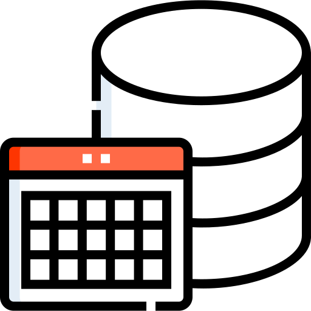
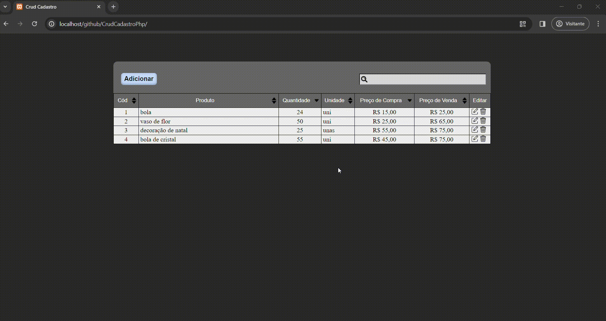
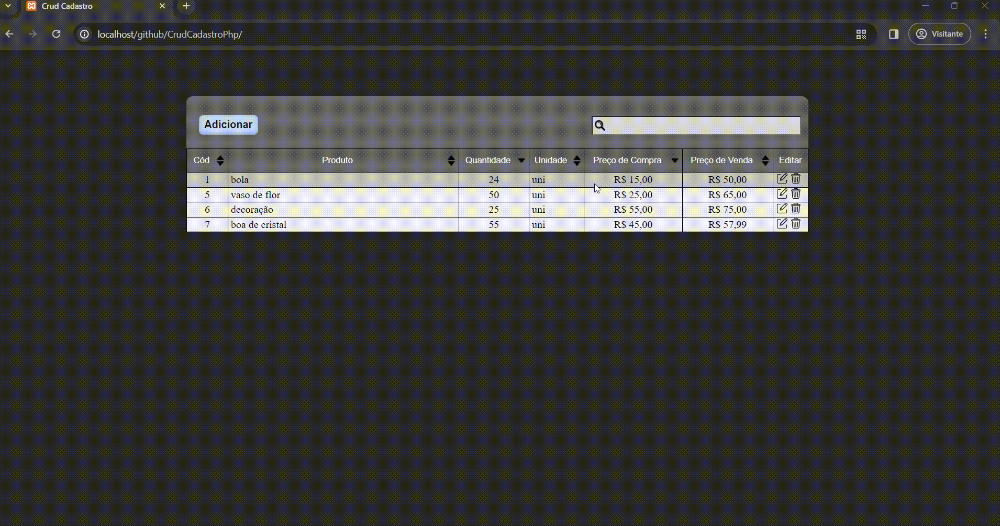
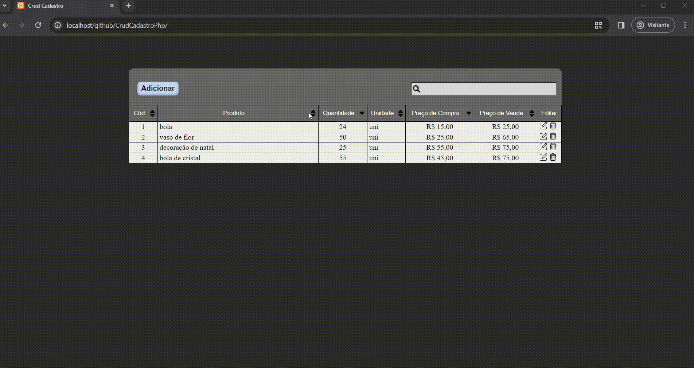
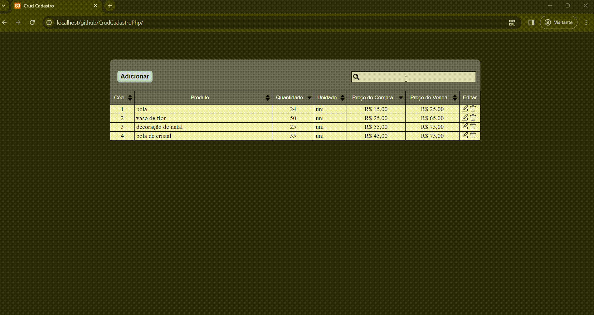

<h1>CrudCadastroPhpBancoDeDados </h1>

<p>Este Repositório está sendo reproveitado do projeto <a href="https://github.com/CarlaDeOliveira99/CrudCadastroPhpTXT">Crud Cadastro PHP TXT</a>, que tem como objetivo melhorar as habilidades em PHP e foi desenvolvido com o uso de PHp, JavaScript, CSS, HTML e PostgresSQL. O projeto inclui uma tabela dinâmica, que permite alterar, deletar e cadastrar os dados, que será salvo no banco de dados.</p>


* [Criar a tabela do banco de dados (PostgreSQL))](#Criar-a-tabela-do-banco-de-dados-(PostgreSQL))
* [Preenchimento dos dados para conexão ao banco de dados](#Preenchimento-dos-dados-para-conexão-ao-banco-de-dados)
* [Cadastrar os dados](#Cadastrar-os-dados)
* [Alterar os dados](#Alterar-os-dados)
* [Deletar os dados](#Deletar-os-dados)
* [Ordenar os dados da tabela](#Ordenar-os-dados-da-tabela)
* [Pesquisar os dados da tabela](#Pesquisar-os-dados-da-tabela)


<h2>Criar a tabela do banco de dados (PostgreSQL) </h2>

<h3>Criar Sequences</h3>

```
  CREATE SEQUENCE seq_id_produto<br>
  START 1
  INCREMENT 1;
```

<h3>Criar Tabela</h3>

```
CREATE TABLE produto (
    id integer NOT NULL default nextval('seq_id_produto'), 
    nome varchar(100),
    quantidade integer NOT NULL,
    unidade varchar(10) NOT NULL,
    preco_de_compra numeric(12,2) NOT NULL,
    preco_de_venda numeric(12,2) NOT NULL
);
```

<h3> <span style="color:blue">Criar Constraints</span></h3>

```
alter table produto add constraint pk_produto primary key(id);
alter table produto add constraint unique_nome unique(nome);
```


**[⬆ Inicio](#CrudCadastroPhpBancoDeDados-)**

<h2>Preenchimento dos dados para conexão ao banco de dados</h2>
<p>Para conectar ao banco de dados, preencha as seguintes informações que estão localizada na pasta Php <a href="https://github.com/CarlaDeOliveira99/CrudCadastroPhpBancoDeDados/tree/main/Php">dados_banco_de_dados.php</a></p>

```
<?php
$host= '';
$db = '';
$user = '';
$password = '';
?>
```
   
**[⬆ Inicio](#CrudCadastroPhpBancoDeDados-)**

## Cadastrar os dados
<p>Para a tela de cadastro, foi utilizado um modal. Após clicar em ‘salvar’, os dados são salvos no banco de dados. </p>


**[⬆ Inicio](#CrudCadastroPhpBancoDeDados-)**

## Alterar os dados
<p>Para alterar os dados da tabela, foi utilizado um ícone que, ao ser clicado, faz aparecer um modal com as informações da linha a serem alteradas. Após clicar em ‘Alterar’, as informações são também modificadas no banco de dados.</p>



**[⬆ Inicio](#CrudCadastroPhpBancoDeDados-)**

## Deletar os dados
<p>Para deletar os dados da tabela, foi utilizado um ícone de lixeira. Ao ser clicado, o campo com as informações é removido da tabela e do banco de dados.</p>



**[⬆ Inicio](#CrudCadastroPhpBancoDeDados-)**

## Ordenar os dados da tabela
<p>A tabela permite ordenar cada coluna. Pode ser de forma crescente, decrescente ou em ordem alfabética.</p>



**[⬆ Inicio](#CrudCadastroPhpBancoDeDados-)**


## Pesquisar os dados da tabela
<p>O campo de pesquisa destaca as palavras conforme são digitadas e traz as linhas que possuem as palavras pesquisadas. As demais são ocultadas.</p>



**[⬆ Inicio](#CrudCadastroPhpBancoDeDados-)**


